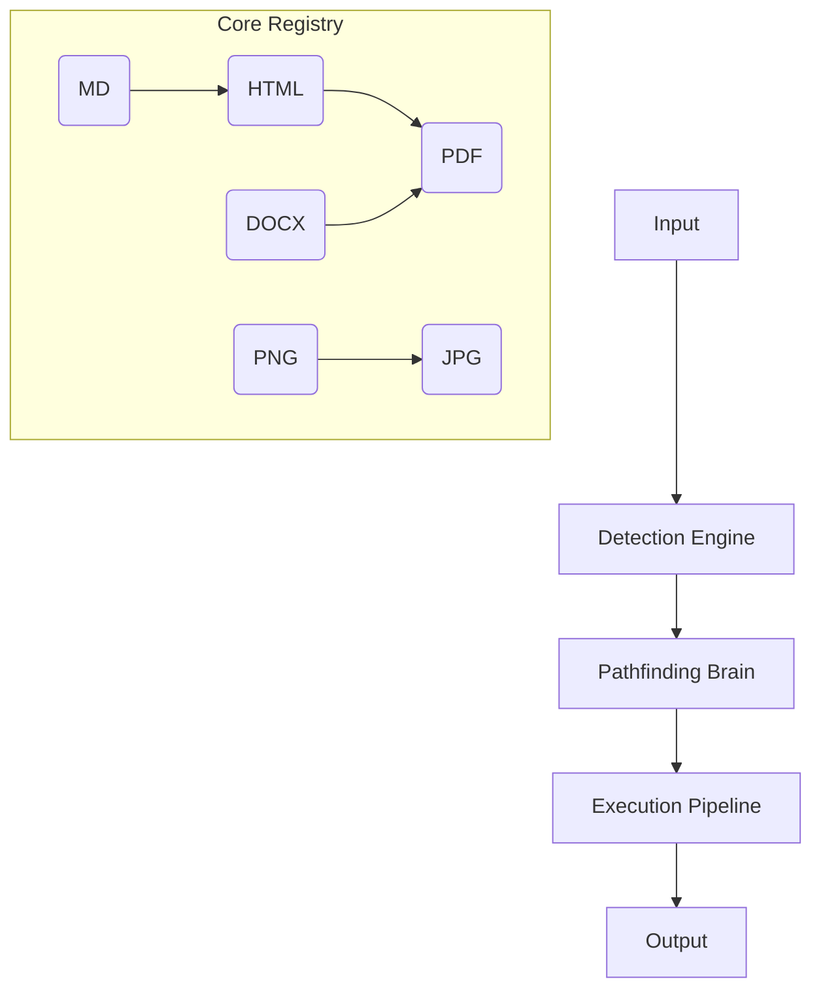

# System Architecture

ConvertKit is a **Universal Conversion Engine** architected for scale, modularity, and a clear separation between open-source logic and commercial policy.

## 1. The Conversion Graph

At its heart, ConvertKit treats formats as nodes and converters as directed edges in a graph.

### **Breadth-First Search (BFS)**
The core engine uses a BFS algorithm to discover the shortest path between formats. If a direct converter doesn't exist, it automatically chains available converters (e.g., `Markdown -> HTML -> PDF`).

## 2. Monorepo Structure

We use a flat package structure to ensure every converter is independently versionable and usable.

- `packages/core`: Pathfinding, registry, and detection logic.
- `packages/cli`: Terminal interface wrapping the core.
- `packages/converter-*`: Individual engine adapters (Sharp, FFmpeg, etc.).
- `apps/playground`: The Developer Hub and reference web implementation.

## 3. Open Source vs Hosted Boundary

A critical architectural rule: **Commercial Policy ≠ Conversion Engine.**

| Feature | Layer | Responsibility |
| :--- | :--- | :--- |
| Pathfinding | Core | Finding the "how" |
| Conversion | Converter | Executing the "what" |
| Entitlements | Hosted | Deciding "if" (Limits, Pro features) |
| Billing | Hosted | Handling "who pays" |

The open-source core MUST NOT depend on accounts, billing, or cloud-only APIs.

## 4. Security & Isolation

ConvertKit treats all inputs as untrusted data.
- **Content-Aware Detection:** We use magic number signatures to prevent extension-spoofing attacks.
- **Process Isolation:** Heavy engines (FFmpeg, LibreOffice) run in subprocesses with resource limits.
- **Ephemeral Files:** Automatic cleanup of intermediate buffers and temporary files in the pipeline.
